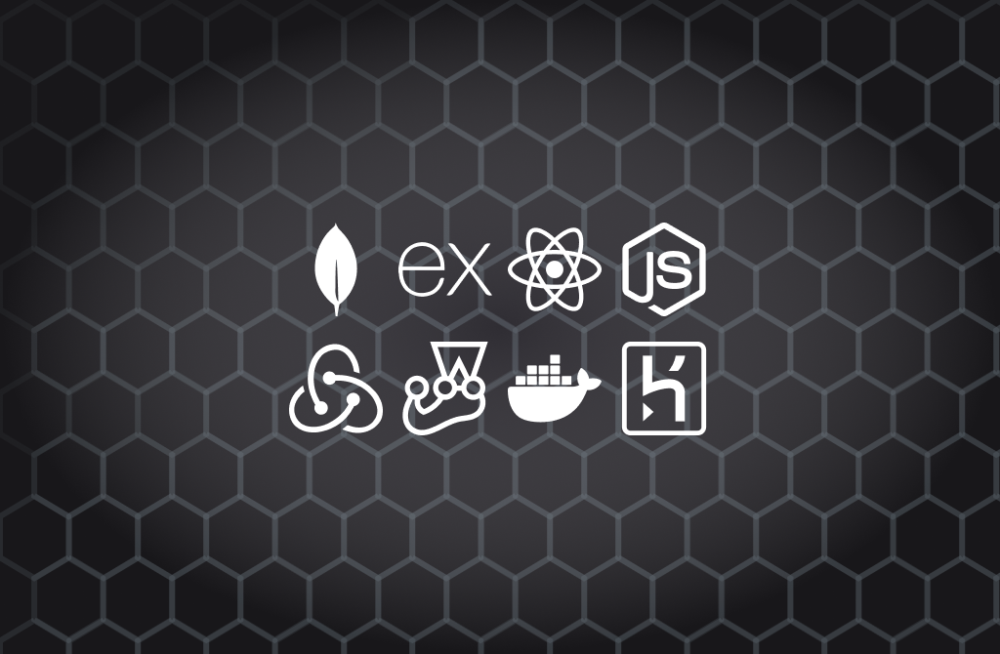

<p align="center">
  <a href="" rel="noopener">
 </a>
</p>

<h1 align="center">Case study: MERN+ Stack</h1>

---

<p align="center"> Case study: Simple MERN+ Stack application
    <br> 
    <br> 
    <a href="https://yuki2dev-study-mern-stack.herokuapp.com">
    
    </a>
    <br> 
    
</p>

## 📝 Table of Contents

- [About](#about)
- [Getting Started](#getting_started)
- [Deployment](#deployment)
- [Built Using](#built_using)
- [Authors](#authors)
- [Acknowledgments](#acknowledgement)

## 🧐 About <a name = "about"></a>

Simple project using modern MERN stack with the main objectives of learning Redux + Toolkit, Mongoose + MongoDB, basic authentication using JWT and running locally docker.

## 🏁 Getting Started <a name = "getting_started"></a>

### Prerequisites

```
Node version >= 16.14.0
```

### Installing

1. Install all dependencies

```bash
yarn install
```

2. Run the development enviroment

```bash
yarn dev
```

## 🚀 Deployment <a name = "deployment"></a>

- You can deploy clicking the button below on Heroku

[](https://heroku.com/deploy?template=https://github.com/KeysHD/study-mern-stack)

## ⛏️ Built Using <a name = "built_using"></a>

<p align="left">
    
    
    
    
    
    
    
    
</p>

## ✍️ Authors <a name = "authors"></a>

- [@Yuki2dev](https://github.com/KeysHD)

## 🎉 Acknowledgements <a name = "acknowledgement"></a>

- This project was created by following the [Brad Traversy](https://github.com/bradtraversy) MERN Stack tutorial
